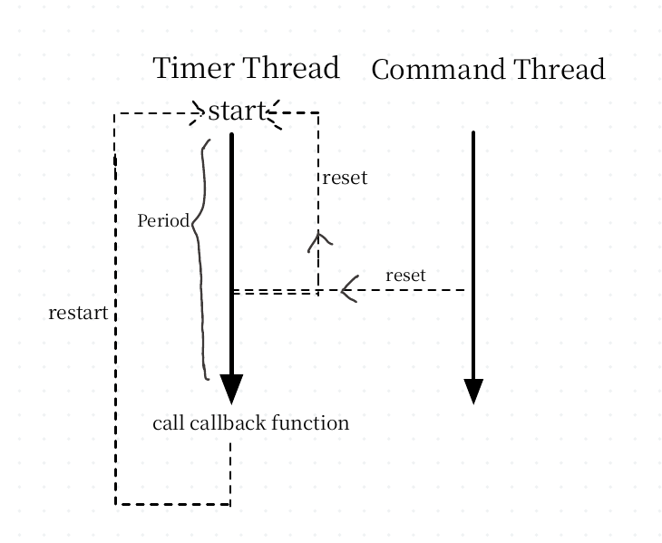

# Callback Timer

## Feature 

* support each type of function.
* use perfect forward to avoid duplicate type.
* use `unique_lock` to avoid data race.
* use `condition_variable` to notify timer thread execute command.
* use `condition_variabel::wait_for` to awake periodically.


## Structure




## Usage

```cpp
/* see test_timer.cpp */
class self_define_class {
public:
    void f() {
        cout << "Hello Member function" << endl;
    }
};

void f() {
    cout << "Hello normal function" << endl;
}

void f_with_params(int i) {
    cout << "Hello Member function with value i: " << i  << endl;
}


using namespace std;

int main() {
    using ms = std::chrono::milliseconds;
    using s = std::chrono::seconds;

    /* period: 1000ms */
    Timer<ms> timer1(1000);
    timer1.set_callback(f);
    timer1.run();

    Timer<ms> timer2(1000);
    timer2.set_callback(&f_with_params, 10);
    timer2.run();

    self_define_class obj;
    Timer<ms> timer3(1000);
    timer3.set_callback(&self_define_class::f, &obj);
    timer3.run();

    this_thread::sleep_for(s(2));

    timer1.pause();
    timer2.pause();
    timer3.pause();
    cout << "paused" << endl;
    this_thread::sleep_for(s(2));

    timer1.restart();
    timer2.restart();
    timer3.restart();
    while (true);
}
```

